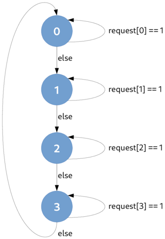
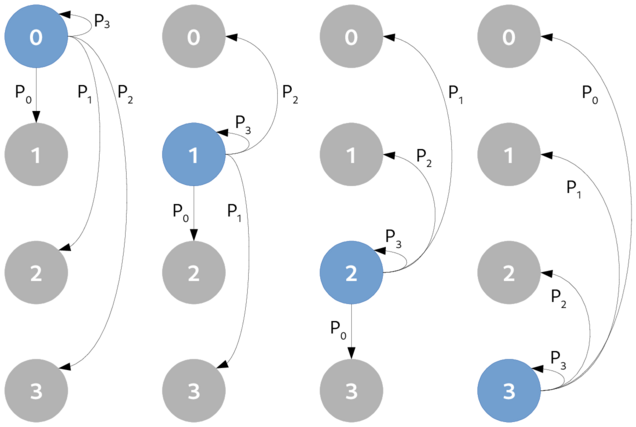
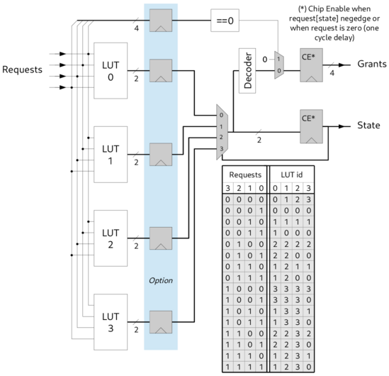

Parallel Round-Robin Arbiter
============================

Description
-----------

The basic structure of a sequential round-robin relies on a Finite State Machine (FSM) which scans a
specific request at each clock cycle, every time in the same order. As show in the following figure,
when a request is asserted, and if the round-robin is in the state dedicated to this request, the
request will be granted. Once the request is cleared, the round-robin go to the next state and so
on.

The major drawback of the sequential round-robin implementation is the latency introduced to scan
every request input even if no requests are asserted.

An optimization to reduce drastically the latency is to allow the arbiter to jump directly to the
state corresponding to the request raised. To prevent starvation, priority must be introduced to
grant requests in a fair way. Moreover, while a request is served or if no requests are asserted,
the arbiter must not change its state.

The next figure presents a parallel implementation of the round robin. The state transition
:math:`$P_k$` corresponds to the relation :math:`$P_k \leftarrow \text{request}[k]==1$`,
:math:`$P_0$` is evaluated with the highest priority and :math:`$P_3$` with the lowest priority.

An extra highest priority transition, which is not mentioned in the next figure, must be added to
all states to keep the current state until the granted request ends. This end condition is detected
when a lowering edge of the request :math:`k` occurs when the arbiter is in state :math:`k`.

Architecture diagram of the parallel round-robin is depicted in the figure hereafter. The FSM
transition's equations of each state are split into LUT. The right LUT is selected using a
multiplexer depending on the state register. This type of implementation allows to provide a simple
way to describe, using HDL languages, a generic parallel priority round-robin arbiter in terms of
number of input requests. Moreover, the critical path can be reduced using optional pipeline
registers just after the LUT outputs. Depending on these registers, the arbiter will respond with
one ore two cycles latency.

Parameters
----------

===========  =====  ==============  ========================================
Name         Type   Default value   Description
===========  =====  ==============  ========================================
WIDTH               4               Number of requester
-----------  -----  --------------  ----------------------------------------
LOG2_WIDTH          $clog2(WIDTH)   clog2 number of requester
-----------  -----  --------------  ----------------------------------------
PIPELINE            1               Add one register wall
===========  =====  ==============  ========================================

Signals
-------

========  ===========  =================  ========================================
Name      I/O type     Range              Description
========  ===========  =================  ========================================
clk       input wire   1                  Clock
--------  -----------  -----------------  ----------------------------------------
srst      input wire   1                  Synchronous reset
--------  -----------  -----------------  ----------------------------------------
request   input wire   [WIDTH-1:0]        Request inputs
--------  -----------  -----------------  ----------------------------------------
state     output reg   [LOG2_WIDTH-1:0]   State of the round robin
--------  -----------  -----------------  ----------------------------------------
grant     output reg   [WIDTH-1:0]        Grant outputs
========  ===========  =================  ========================================
