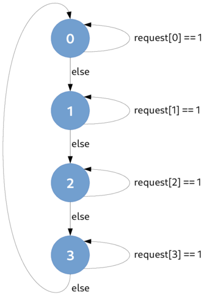
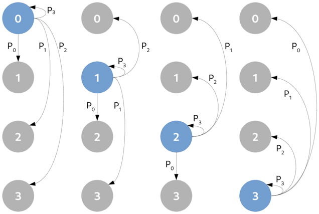
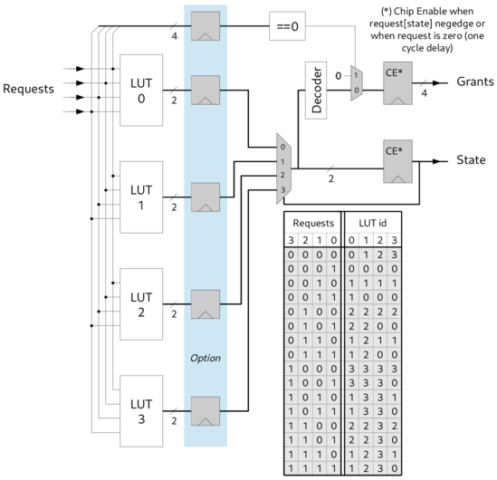

Parallel Round-Robin Arbiter
=============================

Description
-----------

The ``prra`` module implements a parallel round-robin arbiter that accepts multiple request signals
and grants one at a time in a fair, rotating priority order. Unlike sequential round-robin arbiters,
which scan requests one by one, this parallel implementation can jump directly to the state
corresponding to an asserted request, reducing latency. The number of requesters is parameterizable
(``WIDTH``), and optional pipelining (``PIPELINE``) can be enabled to reduce the critical path,
resulting in a response latency of one or two cycles. The arbiter ensures fairness and prevents
starvation by maintaining state until the granted request ends.

The basic structure of a sequential round-robin relies on a Finite State Machine (FSM) which scans a
specific request at each clock cycle, always in the same order. When a request is asserted, and if
the round-robin is in the state dedicated to this request, the request will be granted. Once the
request is cleared, the round-robin moves to the next state.

The major drawback of the sequential round-robin implementation is the latency introduced to scan
every request input even if no requests are asserted. The parallel implementation solves this by
allowing the arbiter to jump directly to the state corresponding to the raised request.

   Sequential Round-Robin FSM

   Parallel Round-Robin FSM

   Parallel Round-Robin Arbiter Architecture

Parameters
----------

===========  ==============  ========================================
Name         Default value   Description
===========  ==============  ========================================
WIDTH        4               Number of requesters
LOG2_WIDTH   $clog2(WIDTH)   Ceil log2 of number of requesters
PIPELINE     1               Add one register stage (2-cycle latency)
===========  ==============  ========================================

Signals
-------

========  ===========  =================  ========================================
Name      I/O type     Range              Description
========  ===========  =================  ========================================
clk       input wire   1                  Clock
srst      input wire   1                  Synchronous reset
request   input wire   [WIDTH-1:0]        Request inputs
state     output reg   [LOG2_WIDTH-1:0]   Current arbiter state
grant     output reg   [WIDTH-1:0]        Grant outputs (one-hot)
========  ===========  =================  ========================================

Example Instantiation
---------------------

.. code-block:: verilog

   prra #(
     .WIDTH(4),
     .LOG2_WIDTH($clog2(4)),
     .PIPELINE(1)
   ) u_prra (
     .clk(clk),
     .srst(srst),
     .request(request),
     .state(state),
     .grant(grant)
   );

Simulation
----------

.. code-block:: bash

   cd project
   make sim    # Icarus Verilog simulation
   make trace  # Simulate and open GTKWave
   make lint   # Lint with Verilator

License
-------

This module is licensed under the **CERN Open Hardware Licence Version 2 - Permissive (CERN-OHL-P-2.0)**.
See `LICENSE <../../LICENSE>`_ for details.
