# HyNoC's documentation

* [Introduction](#introduction)
* [First Layer Protocol](#first-layer-protocol)
* [Architecture of the router](#architecture-of-the-router)
* [About Virtual Channels](#about-virtual-channels)
* [Citations](#citations)

---

## Introduction

**HyNoC** (Hyper-performance NoC) is a Network-On-a-Chip dedicated to High Performance Computing with static and dynamic routing capabilities. It can manage any topologies by assembling routers with a variable number of ports and each router implements distributed arbitration schemes within each port. This work was originally based on Hermes [MOR2004] NoC, but many changes are proposed to drastically reduce area and increase performance to mainly target the FPGA domain and the High Performance Computing. If the reader needs some information related to NoC classification, the [AGA2009] survey will be a relevant start point. The HyNoC router is built upon following characteristics:

* Wormhole switching
* Buffered (FIFO) flow control
* Distributed arbitration
* Fully parallel round robin in each distributed arbiter
* Dedicated clock domain to each port

The first section will present the first layer NoC Protocol before explaining, in a second section, the router architecture details. The third sections will explain our technical choices regarding virtual channels and source routing. As a NoC is a medium to exchange information, the fifth section will be dedicated to data transfer and synchronization protocol in an many-core environment, this last section will also present NoC local interfaces and DMA architecture to achieve high speed and reliable transfers.

---

## First Layer Protocol

### Packet routing

HyNoC uses source routing techniques to send data through routers. Instead of addressing node with coordinates, for instance (x,y) for a network with a mesh topology, we define in the packet's header the route to take through the network. This means that the header contains a list of output ports, called **hops**, of routers to cross. This technique is used by [LIW2007] and [MUB2010] to avoid congestion with a low packet header overhead using a simple encoding hop scheme. A routing algorithm can be defined upon Source Routing network depending on topology. [MUB2010] survey presents such a technique. The routing algorithm generates for each communication the list of hops either dynamically (in hardware in the local interface or in software using the node's processor) or statically at compilation time. Routes are established in a distributed way in each router, this technique is presented by [PON2010]. Each egress interface manage itself and it is in charge of selecting the right ingress interface using a simple request/acknowledge protocol. Moreover, the egress interface embeds a LUT-based parallel round robin arbiter to respond in fix amount of time without creating any starvation.

### Packet structure

A packet is composed of multiple flits, a flit is the smallest unit transmitted over the network and it is composed of $k+1$ bits. The most significant bit is a stop bit and it indicates the last flit of a packet. The figure [Packet definition using the last payload to close the channel](#figure-packet-def-1) shows the packet structure. A packet is built with at least one Network Hops flit followed by at least one Payload flit. If multiple header flits are used to encode the path through the network, the router will consider only the first flit as a header and the remaining flits as payload. When all hops of the header are marked used, this header flit will not be forwarded to the next router. Thus, the next router will use the next flit as a header flit and so on.

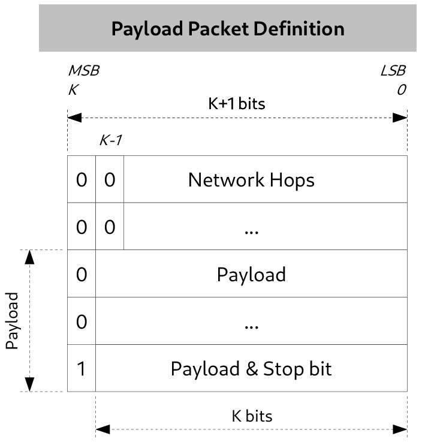

The figure [Example of a minimal HyNoC Packet](#figure-packet-def-min-example) presents the smallest packet that can be sent over the network. The number of router that it can pass through depends on the width of the flit and the number of ports within a router.

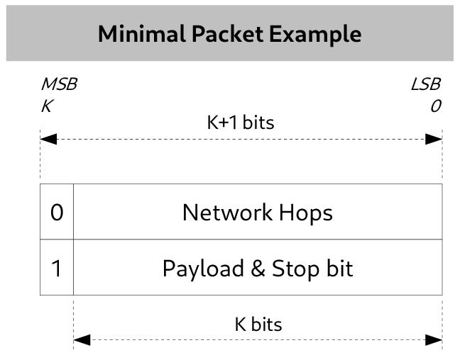

The Network Hops flit, presented in figure [Network Hops flit structure](#figure-packet-def-net-hops), is a list of router egress id to cross. These ids are encoded as described in the next subsection (see figure [Hops values to communicate...](#counting-problem)). An index field is included to point the correct hop to be used by the router's ingress port.

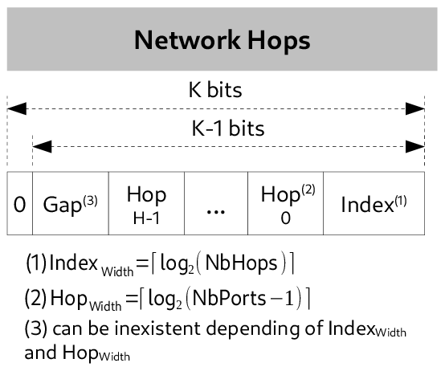

The index is numbered between $[0, H[$ for a flit with $H$ hops and it is initialized to $H-1$. This allows to feed directly the multiplexer command of the ingress port in charge of selecting the right hop in the first flit of an incoming packet. The index is decremented once the pointed hop is used to open the path inside the router. If the index is null before path opening, the related Network Hops flit will not be transmitted to the router's egress port, else the index is decremented and the Network Hops flit is transmitted. The MSB bit of the routing flit is set to zero, this will allow in the future to add sub-types to header flit category.

### Hops encoding

The hop encoding is based upon the fact that a same packet can not use the same port for incoming and outgoing. The number of accessible egress port are $P-1$ for a router with $P$ ports. This technique also reduces the internal router's crossbar, or it gives an additional crossbar *free* port that can be used for the local interface with a network node such as a processor, an accelerator, a memory, ...

The figure [Hops values to communicate...](#counting-problem) shows the hops list `[0 -> 2 -> 0 -> 1 -> 2]` to establish a communication channel from node $(0,0)$ to node $(2,2)$ in a $3 \times 3$ mesh network. This NoC is built upon 5-port routers and only two bits are needed to encode each hop.

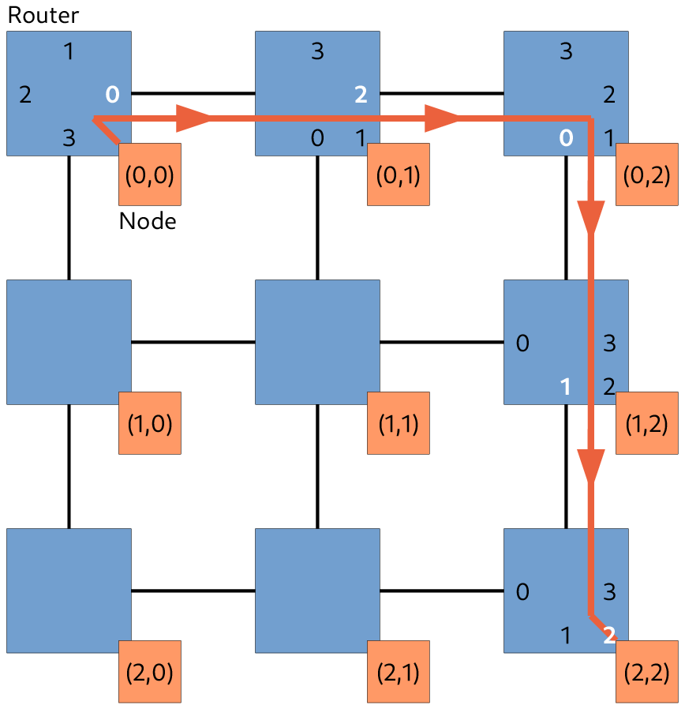

The drawback of this encoding is that each ports encodes the next counterclockwise egress with the zero id. In other words, the selected egress id must be calculated by taking into account the ingress id, this is relative egress addressing.

---

## Architecture of the router

### General overview

A router is made of full-duplex ports which rely on ingress and egress interfaces and that are respectively plugged to egress and ingress of another router's port. Each router has its own clock domains and the crossing rely on dual-clocked FIFO at the input of each ingress interface. A node is attached to a router using a local interface, this interface instantiate an extra FIFO a the egress output to support the node's clock domain. Figure [Router interconnections overview](#figure-noc-overview) shows both internal organization of 5-port routers and how they are connected to their neighbors.

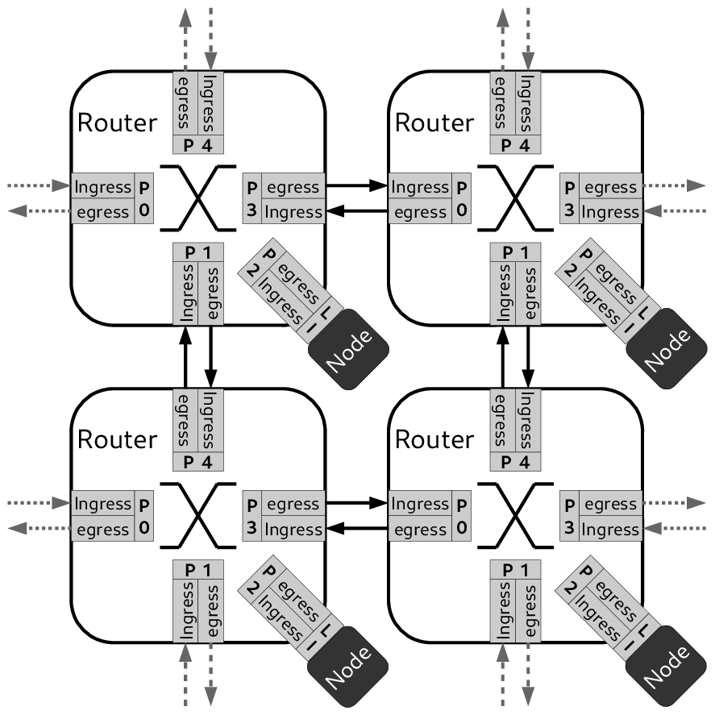

The router is a full crossbar, meaning that each ports can establish a communication to all ports except with itself. Multiple paths inside the router can be opened at the same time thanks to the distributed arbitration scheme. Thus, each egress port embeds an output multiplexer and an arbiter to route, without starvation, data from the ingress ports that has requested a transfer. Figure [Internal data path of a 3-port router](#figure-router-data-arch) presents the data paths between ingress and egress. Each ingress broadcasts its data to all egress ports except to the one which is grouped in the same router port. Then, the egress will forward data to the next router depending on the request asserted by the ingress ports and also depending on the state of the arbiter.

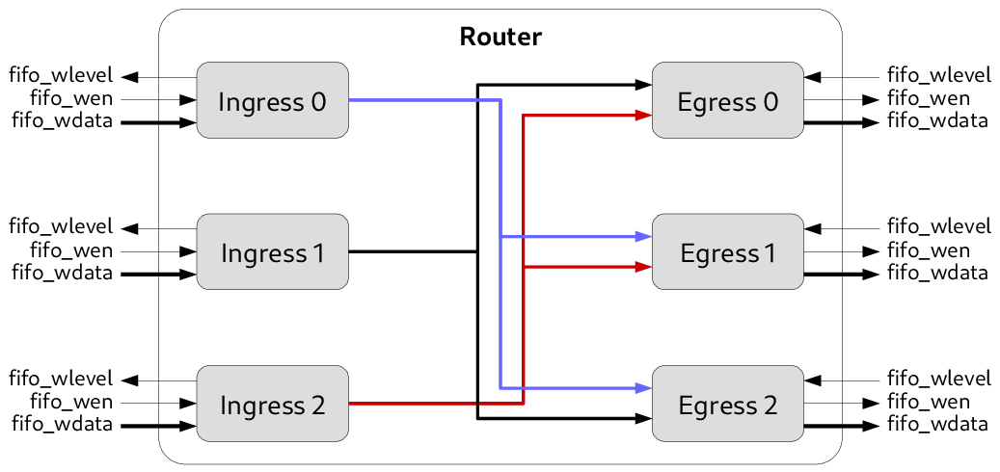

The control path is shown in the figures [Internal control path of a 3-port router](#figure-router-control-arch). Contrary to the data path structure, there is no broadcast of control signals. Each ingress has dedicated links with each egress to assert transmit requests and to receive the grant from an egress. Once the grand is received, the ingress can push data.

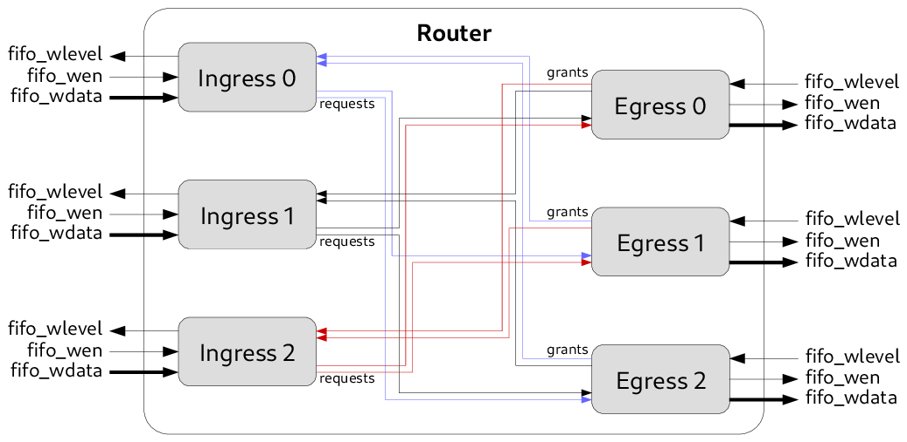

The following subsections is a comprehensive description of ingress and egress interface. The egress arbiter is also described because it use a parallel round-robin arbiter which allows to schedule all ingress requests without starvation in a fix latency.

### Ingress port

The ingress port must manage incoming packets from egress port of another router. It decodes the protocol presented in section [first_layer_protocol](#first-layer-protocol) to route the flit stream to the right internal router egress port. The architecture is shown in [Ingress port architecture](#figure-egress-arch). The starting point of incoming flit is a $2^D$ depth and $(K+1)$-bit width FIFO instantiated within the ingress port. The incoming data to this FIFO come from another router's egress port. The clock domain crossing is made using this FIFO, the write port is connected to the clock domain of the upstream router while the read port uses the clock of the ingress port.

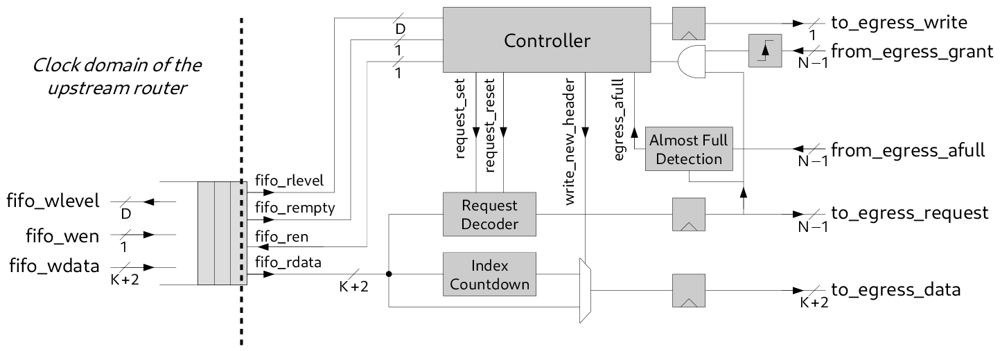

Once some flits are buffered in the FIFO, the port extracts the first flit to find the right request bit among the $N-1$ bits (that corresponds to accessible egress ports), waits for a rising edge of the matching grant bit, then read data from the incoming FIFO and forwards flits to the egress port by managing the flow control. The first flit that must be forwarded is the routing flit updated to the next hop. When the index of this routing flit is null, this flit is discarded. The controller rely on a FSM that reads the two most significant bits of the *fifo_rdata* which indicates the flit type. Once the flit type is known, the FSM can easily looks for the request bit to assert and opens the transmission channel with the right egress port. The FSM is also in charge of managing the flow control by both scanning levels of downstream router FIFO and internal ingress FIFO.

### Egress port

The egress port is connected to $N-1$ ingress ports with a data path width $K+1$ (including the last flit bit). It is in charge of scheduling all ingress write requests that have to access to the FIFO of the next router ingress input. As a reminder, the FIFO depth is $2^D$.

The [figure Egress port architecture](#figure-egress-arch-2) presents the output port architecture. The arbiter used to prevent starvation is a parallel round-robin arbiter (PRRA) which responds to any requests in one cycle if the output port is not currently in use. This arbiter is described in the next section.

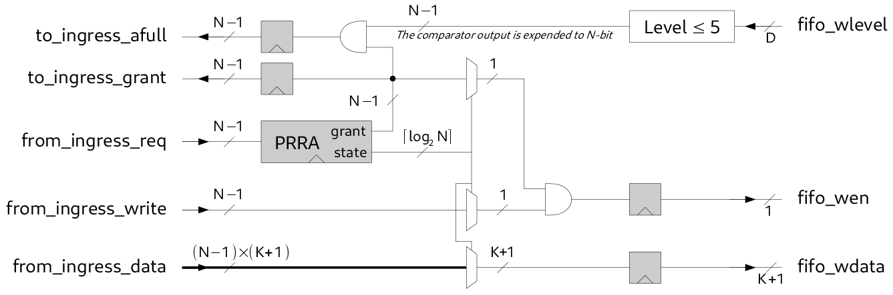

Once the grant signal is sent to the right ingress port, the data and write enable signal are routed from the ingress to the next router ingress fifo. The next router ingress fifo level is forwarded to the granted ingress to be able to manage correctly the flow control.

### Arbitration

The arbitration used in an egress port is based on a round-robin which gives a starvation-free scheduling. The basic algorithm presented in [figure Sequential implementation of the round-robin](#figure-sequential-round-robin-fsm) relies on a Finite State Machine (FSM) which scans a specific request at each clock cycle, every time in the same order. When a request is asserted by an ingress port, and if the round-robin is in the state dedicated to this port, the request will be granted. Once the ingress port clears its request, the round-robin go to the next state and so on.

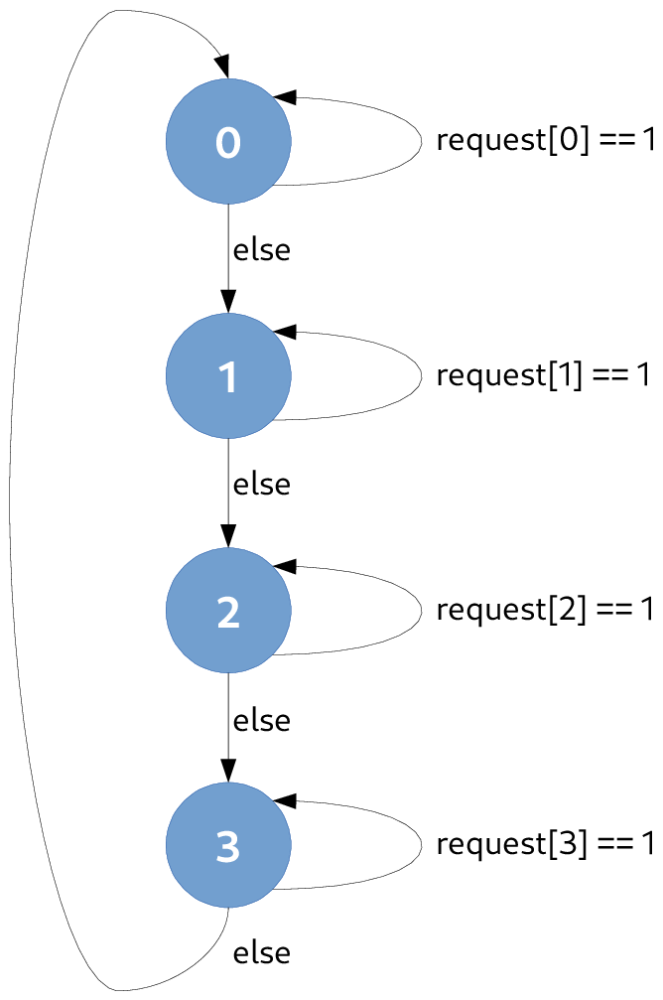

The major drawback of the sequential round-robin implementation is the latency introduced to scan every input even if no requests are asserted. The opening path latency between two nodes across a large network can be high because of the delays to grant a request due to the sequential round-robin, so it significantly penalizes small data transfers. An optimization to reduce drastically the latency is to allow the arbiter to jump directly to the state corresponding to the request raised. To prevent starvation, priority must be introduced to grant requests in a fair way. Moreover, while a request is served or if no requests are asserted, the arbiter must not change its state. The [figure Parallel implementation of the round-robin](#figure-parrallel-round-robin-fsm) shows a parallel implementation of the round robin. The state transition $P_k$ corresponds to the relation given at [eq-parallel-round-robin-transition](#eq-parallel-round-robin-transition), $P_0$ is evaluated with the highest priority and $P_3$ with the lowest priority.

$$P_k \leftarrow \text{request}[k]==1$$

An extra highest priority transition, which is not mentioned on the [figure Parallel implementation of the round-robin](#figure-parrallel-round-robin-fsm), must be added to all states to keep the current state until the granted request ends. This end condition is detected when a lowering edge of the request $k$ occurs when the arbiter is in state $k$.

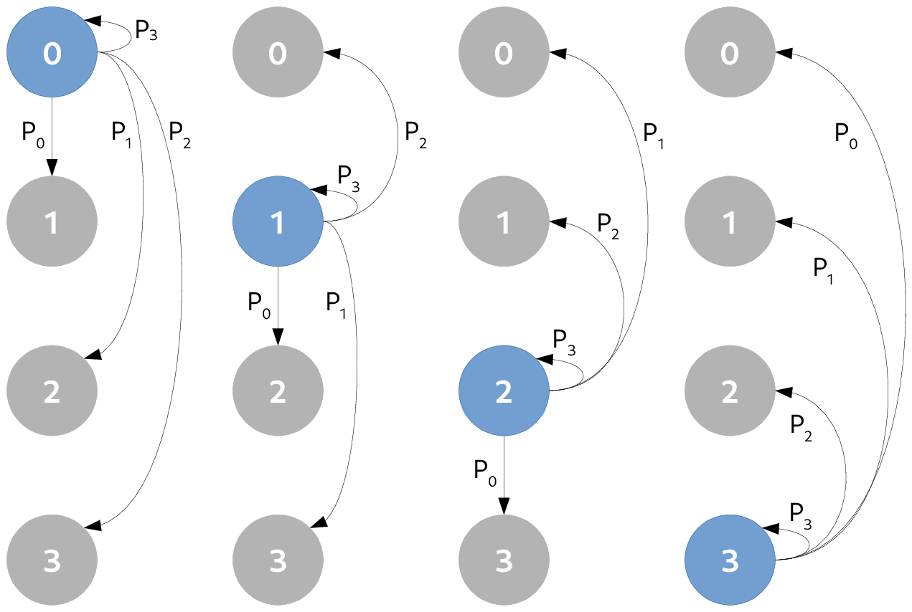

Architecture diagram of the parallel round-robin is presented in [figure Parallel round-robin arbiter](#figure-prra-arch). The FSM transition's equations of each states are splitted into LUT. The right LUT is selected using a multiplexer depending on the state register. This type of implementation allows to provide a simple way to describe, using HDL languages, a generic parallel priority round-robin arbiter in terms of number of input requests. Moreover, the critical path can be reduced using optional pipeline registers just after the LUT outputs. Depending on these registers, the arbiter will respond with one ore two cycles latency.

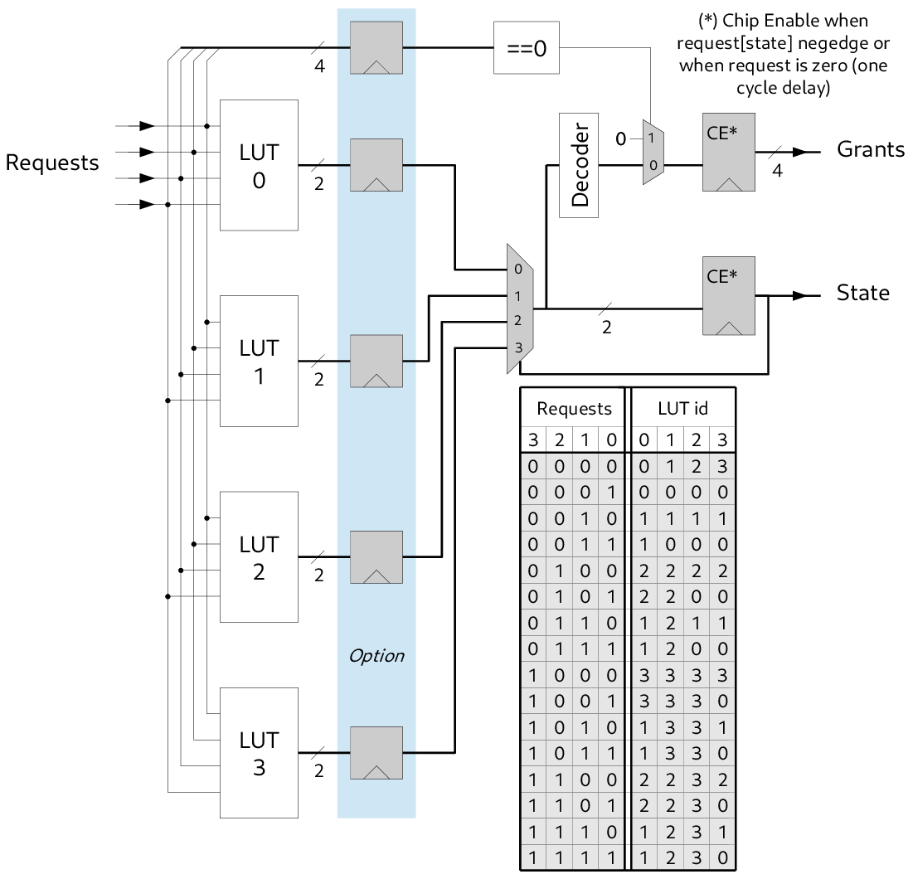

### Local interface

Any port of a router can be connected to a node instead of connecting it to another router's port. To ensure a proper flow control operation, the egress port must be plugged to a FIFO as it was connected to an ingress router's port. This also ease the clock domain crossing between the node and the network. It adds a buffer to smooth the flow and reduces the bottlenecks in the network if the node does not consume data quickly enough.

---

## About Virtual Channels

HyNoC does not implement virtual channels, as proposed by Hermes, for performance reason. Due to multiple clock domains on each router's port, virtual channels imply to multiply the number of input FIFO buffers. We must keep in mind that these input FIFO buffers are responsible of almost fifty percents of the total router area, and according to [MEL2005], doubling the number of virtual channels will double router area. Even if there is not multiple clock domains in a router, the virtual channel scheduling can not be synchronous to the whole network because of routing difficulty and efficiency. The Scheduling signal must be locally synchronous to one router which imply to use one FIFO buffer per virtual channel per router's port. Let's remember the purpose of virtual channels, the main goal is to increase virtual paths into the network and reduce congestion. This can be also achieved without virtual channels by slightly increasing the number of router and, from the client point of view, by providing multiple local interfaces connected to multiple router's ports. In this section, we will discuss about virtual channels efficiency regarding their routing capacities. We will introduce the counting formula of all shortest paths between two nodes in a NoC with various topology. Then we will compare the virtual channel solution against the solution with more basic routers for a given ASIC/FPGA area budget. The last secondly we will analyze the number of routing paths regarding the NoC area.

### Counting shortest paths

We want to count the number of minimal paths between two nodes of a NoC. If the two nodes are not located at extremity, we will consider the *smallest* enclosing these two nodes. The figure [The six shortest paths in a 3x3 network](#figure-counting-problem) shows a $3 \times 3$ network and the six minimum paths between nodes A and B.

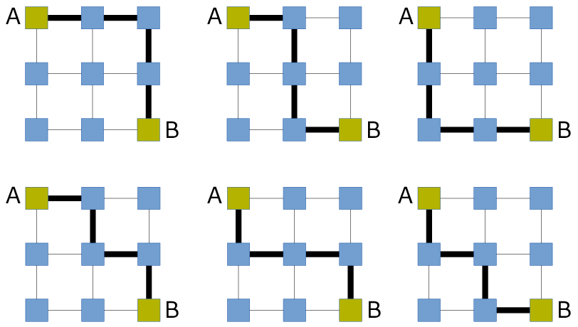

Counting shortest paths is a problem related to [Catalan Number](http://en.wikipedia.org/wiki/Catalan_number) which occurs in various counting problems and is equivalent to counting [Dyck words](http://en.wikipedia.org/wiki/Dyck_word#Applications_in_combinatorics), with *X* corresponds to an horizontal move and *Y* to a vertical move. Using Dyck words, all shortest paths of a $3 \times 3$ network can be enumerated as follow: XXYY, XYYX, YYXX, XYXY, YXXY, YXYX. We can observe that our counting problem can be interpreted by looking for the number of different permutations of *n* objects, where there are $n_1$ indistinguishable objects of style 1, $n_2$ indistinguishable objects of style 2, ..., and $n_K$ indistinguishable objects of style K. The equation [eq-looking-for-permutations](#eq-looking-for-permutations) gives the number *p* of these permutations.

$$p = \frac{n!}{\prod_{i=1}^{K} n_i!}$$

Applying the equation [eq-looking-for-permutations](#eq-looking-for-permutations) to a network with $N \times M$ routers, we obtain the equation [eq-n-m-permutations](#eq-n-m-permutations). We can verify analytically with the network $3 \times 3$, proposed in figure [The six shortest paths...](#figure-counting-problem), that the number of shortest path is *6*.

$$p = \frac{[(N-1) \cdot (M-1)]!}{(N-1)! \cdot (M-1)!}$$

We can generalize the equation [eq-n-m-permutations](#eq-n-m-permutations) to n-dimensional $n_1 \times n_2 \times \cdots \times n_K$ network using the equation [eq-n-dim-permutations](#eq-n-dim-permutations).

$$p = \frac{[\prod_{i=1}^{K} n_i-1]!}{\prod_{i=1}^{K} (n_i-1)!}$$

### Shortest paths regarding network topology

The following tables gives some figures related to the total number of shortest paths for various NoC topology without virtual channels.

**2-dimensional NoC without virtual channels**

| NoC Topology | Number of Routers | Nb shortest paths | Shortest path length |
|---|---|---|---|
| 2 x 2 | 4 | 2 | 2 |
| 4 x 4 | 16 | 20 | 6 |
| 6 x 6 | 36 | 252 | 10 |
| 8 x 8 | 64 | 3432 | 14 |
| 10 x 10 | 100 | 48620 | 18 |
| 12 x 12 | 144 | 705432 | 22 |
| 14 x 14 | 196 | 10400600 | 26 |
| 16 x 16 | 256 | 155117520 | 30 |

**3-dimensional NoC without virtual channels**

| NoC Topology | Number of Routers | Nb shortest paths | Shortest path length |
|---|---|---|---|
| 2 x 2 x 2 | 8 | 6 | 3 |
| 3 x 3 x 3 | 27 | 90 | 6 |
| 4 x 4 x 4 | 64 | 1680 | 9 |
| 5 x 5 x 5 | 125 | 34650 | 12 |
| 6 x 6 x 6 | 216 | 756756 | 15 |

**4-dimensional NoC without virtual channels**

| NoC Topology | Number of Routers | Nb shortest paths | Shortest path length |
|---|---|---|---|
| 2 x 2 x 2 x 2 | 16 | 24 | 4 |
| 3 x 3 x 3 x 3 | 81 | 2520 | 6 |
| 4 x 4 x 4 x 4 | 256 | 369600 | 12 |

We observe that the network topology has a strong influence regarding routing capacities of a network but also with the shortest path length. For the same number of routers, when the dimension of interconnection topology increases, the number of shortest paths and their length will decrease. Reducing the number of shortest paths is a drawback while reducing their lengths is a benefit because the latency is reduced.

### Efficiency of virtual channels

Virtual channels can be viewed as an additional dimension to the network topology. This assumption fits well with the increase number of shortest path powered by virtual channels without increasing the number of routers.

---

## Citations

* [MOR2004] Fernando Moraes, Ney Calazans, Aline Mello, Leandro Möller, Luciano Ost, HERMES: an infrastructure for low area overhead packet-switching networks on chip, Integration, the VLSI Journal, Volume 38, Issue 1, October 2004, Pages 69-93, ISSN 0167-9260.
* [MEL2005] Mello, Aline, et al, Virtual channels in networks on chip: implementation and evaluation on hermes NoC, Proceedings of the 18th annual symposium on Integrated circuits and system design, ACM, 2005.
* [LIW2007] Ma Liwei, Sun Yihe, On-chip network design automation with source routing switches, Tsinghua Science and Technology, vol.12, no.1, pp.77,85, Feb. 2007.
* [AGA2009] A. Agarwal, C. Iskander, and R. Shankar, Survey of Network-on-Chip (NoC) Architectures & Contributions, J. Eng., Computing and Architecture, vol. 3, no. 1, 2009.
* [MUB2010] Saad Mubeen and Shashi Kumar. 2010. Designing Efficient Source Routing for Mesh Topology Network on Chip Platforms. In Proceedings of the 2010 13th Euromicro Conference on Digital System Design: Architectures, Methods and Tools (DSD '10). IEEE Computer Society, Washington, DC, USA, 181-188.
* [PON2010] Julian Pontes, Matheus Moreira, Fernando Moraes, and Ney Calazans. 2010. Hermes-a, an asynchronous NoC router with distributed routing. In Proceedings of the 2010 IEEE International Symposium on Circuits and Systems (ISCAS 2010). IEEE.
