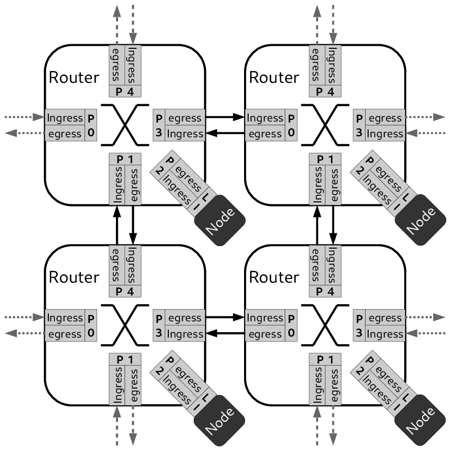
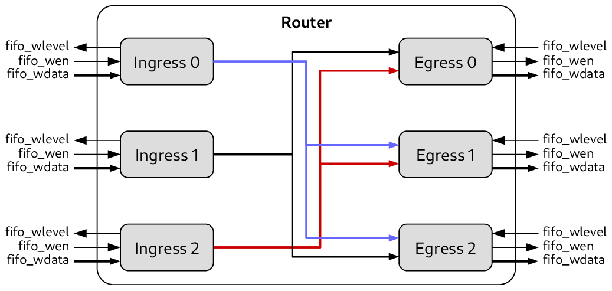
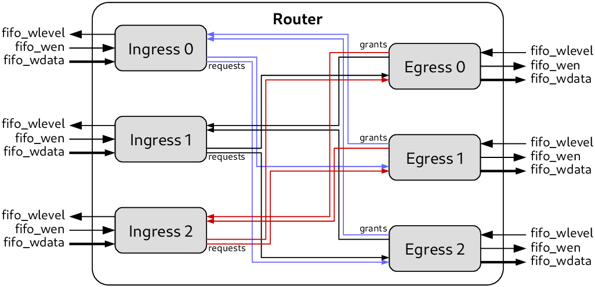
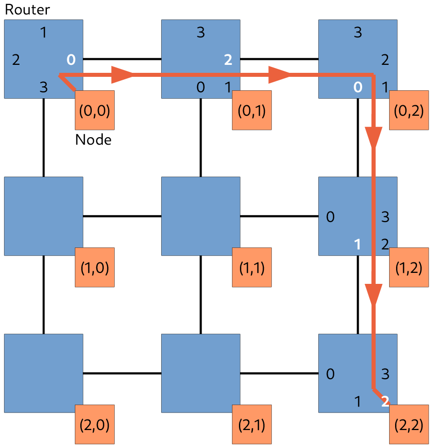
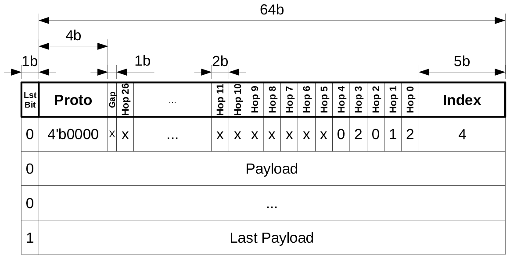
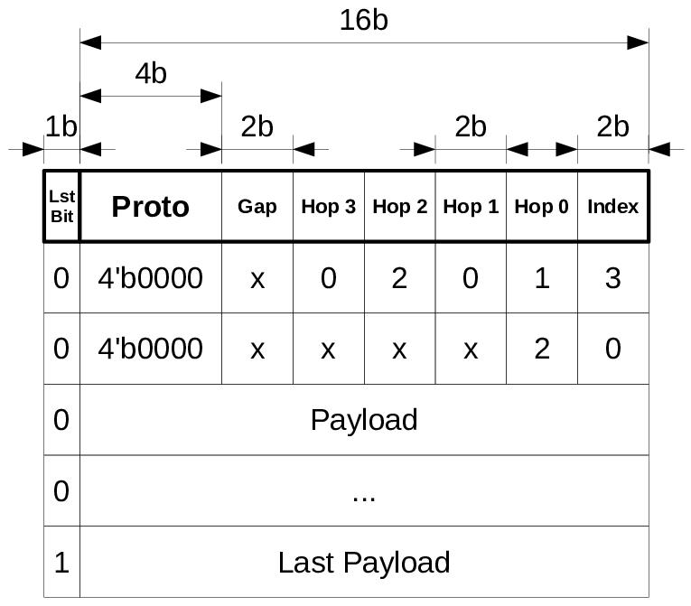
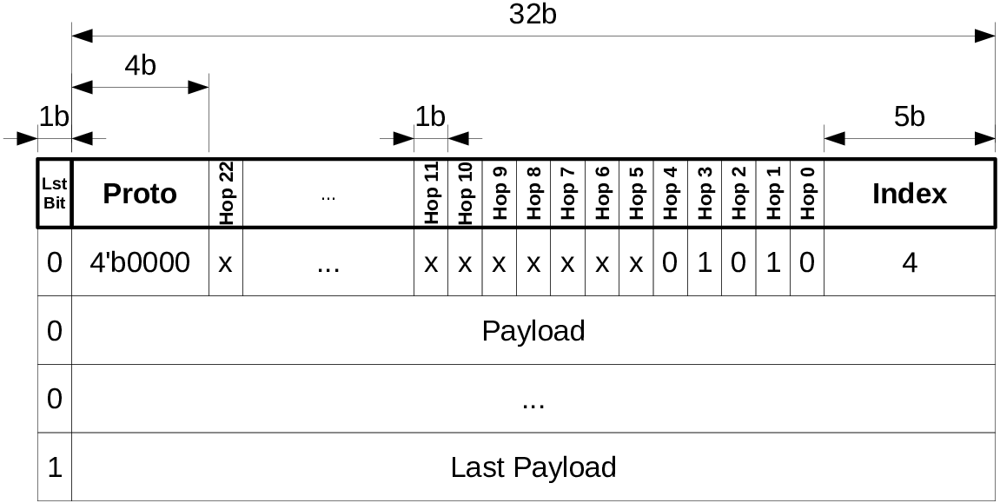
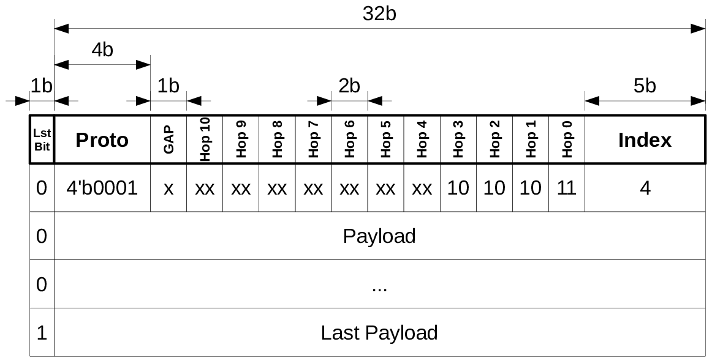
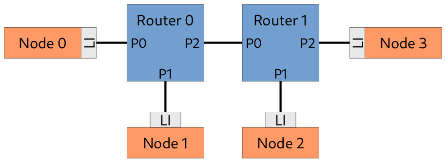

HyNoC: High-performance Network-on-Chip
=======================================

**HyNoC** (High-performance NoC) is a Network-On-a-Chip dedicated to High Performance Computing with
static and dynamic routing capabilities. It can manage any topologies by assembling routers with a
variable number of ports. Each router implements a distributed arbitration scheme within each port.

Features
========

The HyNoC router is built upon the following characteristics:

- Wormhole switching
- Buffered (FIFO) flow control
- Distributed arbitration
- Fully parallel round robin in each distributed arbiter
- Dedicated clock domain to each port

A router can be delivered in a fully synchronous way (router and port use the same clock
domain). For more complex designs, the router can also be delivered with dedicated clock domains for
the router itself (core clock) and for the interfaces (ifce clocks).

A router can also be delivered with 3 to 9 interfaces—ask us for the exact topology you need. Each
interface embeds a synchronous or asynchronous FIFO with a depth configurable between 2 to 64
elements.

Description
===========

Architecture
------------

A router is made of full-duplex ports which rely on ingress and egress interfaces and that are
respectively plugged to egress and ingress of another router ports. Each router has its own clock
domains and the crossing rely on dual-clocked FIFO at the input of each ingress interface. A node is
attached to a router using a local interface, this interface instantiates an extra FIFO to the
egress output to support the node's clock domain.

   Router interconnections overview

The router is a full crossbar, meaning that each port can establish a communication to all ports
except with itself. Multiple paths inside the router can be opened at the same time thanks to the
distributed arbitration scheme. Thus, each egress port embeds an output multiplexer and an arbiter
to route, without starvation, data from the ingress ports that have requested a transfer.

   Internal data path of a 3-port router

The control path is shown below. Contrary to the data path structure, there is no broadcast of
control signals. Each ingress has dedicated links with each egress to assert transmit requests and
to receive the grant from an egress. Once the grant is received, the ingress can push data.

   Internal control path of a 3-port router

The egress arbiter uses a parallel round-robin arbiter which allows scheduling all ingress requests
without starvation in a fixed latency.

First Layer Protocol
====================

Packet routing
--------------

HyNoC uses source routing techniques to send data through routers. Instead of addressing nodes with
coordinates, for instance (x,y) for a network with a mesh topology, we define in the packet's header
the route to take through the network. This means that the header contains a list of output ports,
called hops, of routers to cross. This technique is used by [LIW2007] and [MUB2010] to avoid
congestion with a low packet header overhead using a simple encoding hop scheme.

A routing algorithm can be defined upon Source Routing network depending on topology. [MUB2010]
survey presents such a technique. The routing algorithm generates for each communication the list of
hops either dynamically (in hardware in the local interface or in software using the node's
processor) or statically at compilation time.

Routes are established in a distributed way in each router, as presented by [PON2011]. Each egress
interface manages itself and is in charge of selecting the right ingress interface using a simple
request/acknowledge protocol. Moreover, the egress interface embeds a LUT-based parallel round robin
arbiter to respond in a fixed amount of time without creating any starvation.

Packet structure
----------------

A packet is composed of multiple flits, a flit is the smallest unit transmitted over the network and
it is composed of K+1 bits. The most significant bit is the last bit and it indicates the last flit
of a packet.

+-----------+-------------------+---------------------+
| Last bit  | 4-bit Proto       | Routing flit        |
+-----------+-------------------+---------------------+
| 0         | ...               | ...                 |
+-----------+-------------------+---------------------+
| 0         | Payload flit      |                     |
+-----------+-------------------+---------------------+
| ...       | ...               | ...                 |
+-----------+-------------------+---------------------+
| 1         | last Payload flit |                     |
+-----------+-------------------+---------------------+

*Table: Packet definition*

The table below presents the smallest packet that can be sent over the network. The number of
routers that it can pass through depends on the protocol, the payload width, and the number of ports
within a router.

+-------------------+-------------------+---------------------+
| Last flit bit     | 4-bit Proto       | Routing flit        |
+-------------------+-------------------+---------------------+
| 1                 | last Payload flit |                     |
+-------------------+-------------------+---------------------+

*Table: Smallest packet*

Routing protocols
-----------------

Multiple protocols can be supported in a routing flit depending on the 4-bit Proto value. The table
below shows supported protocols and the following sub-sections describe how they work.

+--------------+-------------------------------+
| Proto value  | Routing method                |
+==============+===============================+
| 4'b0000      | Unicast Circuit Switch.       |
+--------------+-------------------------------+
| 4'b0001      | Multicast Circuit Switch.     |
+--------------+-------------------------------+
| 4'b1000      | XY routing (not yet impl.).   |
+--------------+-------------------------------+
| 4'b1111      | Forbidden value.              |
+--------------+-------------------------------+

*Table: Supported routing protocols*

Unicast Circuit Switch routing
~~~~~~~~~~~~~~~~~~~~~~~~~~~~~~

In this routing policy, the routing flit is a list of router egress IDs to cross. The table below describes the unicast circuit switch protocol field. For a router with P ports, the Hop field is encoded using W = ceil(log2(P-1)) bits. The index field points to the correct hop to be used by the router ingress port. The Gap width can be in [0, W-1].

+--------+------+---------+-----+--------+-------+
| Proto  | Gap  | Hop H-1 | ... | Hop 0 | Index |
+========+======+=========+=====+=======+=======+
| 4'b0   | ...  | ...     | ... | ...   | ...   |
+--------+------+---------+-----+-------+-------+

*Table: Unicast Circuit Switch Field Description*

The index is numbered between [0, H-1] for a flit with H hops and is initialized to H-1. The index is decremented once the pointed hop is used to open the path inside the router. If the index is null before path opening, the related Network Hops flit will not be transmitted to the router's egress port; else the index is decremented and the updated Routing flit is transmitted. A unicast flit can embed less than the maximum allowed number of hop fields by just initializing the index accordingly.

The hop encoding is based on the fact that a packet cannot use the same port for incoming and outgoing. The number of accessible egress ports is P-1 for a router with P ports. This technique reduces the internal router's crossbar size.

   Unicast Circuit Switch hops encoding

Each port encodes the next counterclockwise egress with the ID zero. In other words, the selected egress ID must be calculated by taking into account the ingress id; this is a relative egress addressing.

An example of a unicast packet is given below. It corresponds to the path described above; the NoC payload width is 64-bit.

   Example of a unicast circuit switch packet of a 64-bit NoC

   Example of a unicast circuit switch packet of a 16-bit NoC

Multicast Circuit Switch routing
~~~~~~~~~~~~~~~~~~~~~~~~~~~~~~~

The multicast routing policy permits targeting multiple egress ports at a time from a unique ingress port. The table below describes the multicast circuit switch protocol field. For a router with P ports, the Hop field width is W = P-1 bits. The index field points to the correct hop to be used by the router ingress port. The Gap width can be in [0, W-1].

As a reminder, the index must be initialized to H-1, because the ingress port forwards the flit by decrementing the index. A multicast flit can embed less than the maximum allowed number of hop fields by just initializing the index accordingly.

+--------+------+---------+-----+--------+-------+
| Proto  | Gap  | Hop H-1 | ... | Hop 0 | Index |
+========+======+=========+=====+=======+=======+
| 4'b1   | ...  | ...     | ... | ...   | ...   |
+--------+------+---------+-----+-------+-------+

*Table: Multicast Circuit Switch Field Description*

Combining multiple routing policies
~~~~~~~~~~~~~~~~~~~~~~~~~~~~~~~~~~~

Multiple types of routing flits can be mixed at the beginning of a packet.

Router example: 32-bit 3-port
=============================

Introduction
------------

The 32-bit 3-port router is delivered with a testbench that demonstrates the functionality and the
behavior of the router. The following subsections describe the packet structure used, the module
parameters and ports description, and an overview of the testing environment proposed.

Packet structure
----------------

The 32-bit 3-port NoC can hold up to 23 hops for unicast packets and up to 11 hops for multicast
packets. The figures below describe the packet structures for both unicast and multicast protocol.

   Unicast packet structure for 3-port 32-bit NoC

   Multicast packet structure for 3-port 32-bit NoC

Parameters
----------

The following module parameters are declared in the 3-port router module:

+------------------------+-------------------------+-------------------------------------------------------------+
| Name                   | Default Value           | Description                                                 |
+========================+=========================+=============================================================+
| INDEX_WIDTH            | 5                       | Bit width of the index in an address flit.                  |
+------------------------+-------------------------+-------------------------------------------------------------+
| LOG2_FIFO_DEPTH        | 5                       | Size of the FIFO inserted in each port's ingress expressed  |
|                        |                         | in log2 basis.                                              |
+------------------------+-------------------------+-------------------------------------------------------------+
| PAYLOAD_WIDTH          | 32                      | Bit width of the payload.                                   |
+------------------------+-------------------------+-------------------------------------------------------------+
| FLIT_WIDTH             | PAYLOAD_WIDTH+1         | Bit width of the flit.                                      |
+------------------------+-------------------------+-------------------------------------------------------------+
| PRRA_PIPELINE          | 0                       | 2-cycle parallel round-robin arbiter response when set to 0 |
|                        |                         | else 3-cycle.                                               |
+------------------------+-------------------------+-------------------------------------------------------------+
| SINGLE_CLOCK_ROUTER    | 0                       | When set to 1, each port uses the router clock instead of   |
|                        |                         | its own clock to reduce the traversal latency.              |
+------------------------+-------------------------+-------------------------------------------------------------+
| ENABLE_MCAST_ROUTING   | 1                       | When set to 1, enable the multicast routing protocol.       |
+------------------------+-------------------------+-------------------------------------------------------------+

*Table: Parameters of the 3-port 32-bit router*
Ports
-----

The router ports are composed of two parts: an ingress side and an egress side. The ingress side
receives data and the egress side sends data. When connecting two ports, the egress port X must be
connected to ingress port Y and vice-versa.

+--------------------------+-------+---------------------+---------------------------------------------------------------+
| Name                     | Dir   | Width               | Description                                                   |
+==========================+=======+=====================+===============================================================+
| router_clk               | In    | 1                   | Internal router clock.                                        |
+--------------------------+-------+---------------------+---------------------------------------------------------------+
| router_srst              | In    | 1                   | Internal router synchronous reset.                            |
+--------------------------+-------+---------------------+---------------------------------------------------------------+
| portX_ingress_clk        | In    | 1                   | Clock of ingress port X, not used if SINGLE_CLOCK_ROUTER=1.   |
+--------------------------+-------+---------------------+---------------------------------------------------------------+
| portX_ingress_srst       | In    | 1                   | Synchronous reset of ingress port X, not used if              |
|                          |       |                     | SINGLE_CLOCK_ROUTER=1.                                        |
+--------------------------+-------+---------------------+---------------------------------------------------------------+
| portX_ingress_write      | In    | 1                   | Send the word in the ingress port X. Must be set only one     |
|                          |       |                     | cycle.                                                        |
+--------------------------+-------+---------------------+---------------------------------------------------------------+
| portX_ingress_data       | In    | FLIT_WIDTH          | Data to send to the ingress port X.                           |
+--------------------------+-------+---------------------+---------------------------------------------------------------+
| portX_ingress_full       | Out   | 1                   | Full signal of the ingress port X. If full, the write request |
|                          |       |                     | is ignored.                                                   |
+--------------------------+-------+---------------------+---------------------------------------------------------------+
| portX_ingress_fifo_level | Out   | LOG2_FIFO_DEPTH+1   | FIFO level of the ingress port X.                             |
+--------------------------+-------+---------------------+---------------------------------------------------------------+
| portX_egress_clk         | In    | 1                   | Clock of egress port X, not used if SINGLE_CLOCK_ROUTER=1.    |
+--------------------------+-------+---------------------+---------------------------------------------------------------+
| portX_egress_srst        | In    | 1                   | Synchronous reset of egress port X, not used if               |
|                          |       |                     | SINGLE_CLOCK_ROUTER=1.                                        |
+--------------------------+-------+---------------------+---------------------------------------------------------------+
| portX_egress_write       | Out   | 1                   | A data is ready on egress port X, set one cycle per data      |
|                          |       |                     | to read.                                                      |
+--------------------------+-------+---------------------+---------------------------------------------------------------+
| portX_egress_data        | Out   | FLIT_WIDTH          | Data to read on egress port X.                                |
+--------------------------+-------+---------------------+---------------------------------------------------------------+
| portX_egress_fifo_level  | In    | LOG2_FIFO_DEPTH+1   | Input FIFO level on egress port X, must be connected to       |
|                          |       |                     | another router.                                               |
+--------------------------+-------+---------------------+---------------------------------------------------------------+

*Table: Ports of the 3-port 32-bit router*

Local Interface
---------------

A local interface can be used to connect a client to a router port. The local interface instantiates
an extra FIFO to the egress router port in order to let the client send and receive data at its own
pace.

The local interface exposes a router side that connects to the egress/ingress router port and a
local side that exposes FIFO interfaces to the client in order to send and receive data. The tables
below present the local interface ports.

**Router side:**

+--------------------------+-------+---------------------+-----------------------------------+
| Name                     | Dir   | Width               | Description                       |
+==========================+=======+=====================+===================================+
| port_ingress_srst        | Out   | 1                   |                                   |
+--------------------------+-------+---------------------+-----------------------------------+
| port_ingress_clk         | Out   | 1                   |                                   |
+--------------------------+-------+---------------------+-----------------------------------+
| port_ingress_write       | Out   | 1                   |                                   |
+--------------------------+-------+---------------------+-----------------------------------+
| port_ingress_data        | Out   | FLIT_WIDTH          |                                   |
+--------------------------+-------+---------------------+-----------------------------------+
| port_ingress_full        | In    | 1                   |                                   |
+--------------------------+-------+---------------------+-----------------------------------+
| port_ingress_fifo_level  | In    | LOG2_FIFO_DEPTH+1   |                                   |
+--------------------------+-------+---------------------+-----------------------------------+
| port_egress_srst         | In    | 1                   |                                   |
+--------------------------+-------+---------------------+-----------------------------------+
| port_egress_clk          | In    | 1                   |                                   |
+--------------------------+-------+---------------------+-----------------------------------+
| port_egress_write        | In    | 1                   |                                   |
+--------------------------+-------+---------------------+-----------------------------------+
| port_egress_data         | In    | FLIT_WIDTH          |                                   |
+--------------------------+-------+---------------------+-----------------------------------+
| port_egress_fifo_level   | Out   | LOG2_FIFO_DEPTH+1   |                                   |
+--------------------------+-------+---------------------+-----------------------------------+

*Table: Local interface port description - Router side*
**Client side:**

+--------------------------+-------+---------------------+-----------------------------------+
| Name                     | Dir   | Width               | Description                       |
+==========================+=======+=====================+===================================+
| local_clk                | In    | 1                   |                                   |
+--------------------------+-------+---------------------+-----------------------------------+
| local_srst               | In    | 1                   |                                   |
+--------------------------+-------+---------------------+-----------------------------------+
| local_ingress_write      | In    | 1                   |                                   |
+--------------------------+-------+---------------------+-----------------------------------+
| local_ingress_data       | In    | FLIT_WIDTH          |                                   |
+--------------------------+-------+---------------------+-----------------------------------+
| local_ingress_full       | Out   | 1                   |                                   |
+--------------------------+-------+---------------------+-----------------------------------+
| local_ingress_fifo_level | Out   | LOG2_FIFO_DEPTH+1   |                                   |
+--------------------------+-------+---------------------+-----------------------------------+
| local_egress_read        | In    | 1                   |                                   |
+--------------------------+-------+---------------------+-----------------------------------+
| local_egress_data        | Out   | FLIT_WIDTH          |                                   |
+--------------------------+-------+---------------------+-----------------------------------+
| local_egress_empty       | Out   | 1                   |                                   |
+--------------------------+-------+---------------------+-----------------------------------+
| local_egress_fifo_level  | Out   | LOG2_FIFO_DEPTH+1   |                                   |
+--------------------------+-------+---------------------+-----------------------------------+

*Table: Local interface port description - Client side*

Test environment
----------------

Two tests are delivered with the 3-port 32-bit NoC to illustrate the two possible communication
modes: unicast and multicast. Both tests use the same network topology as depicted below. The design
consists of 2 routers connected with 4 nodes, and each node is connected to the router using a local
interface (LI).

   Unicast test for 3-port 32-bit routers

**Unicast**

The first test is related to unicast transfers, where each node sends packets to all other
nodes. The hops encoded in the routing flits can be established using the table below, and all node
dialog combinations are listed hereafter:

- Node 0 → Node 1: hops [0]
- Node 0 → Node 2: hops [1 → 0]
- Node 0 → Node 3: hops [1 → 1]

- Node 1 → Node 0: hops [1]
- Node 1 → Node 2: hops [0 → 0]
- Node 1 → Node 3: hops [0 → 1]

- Node 2 → Node 0: hops [1 → 0]
- Node 2 → Node 1: hops [1 → 1]
- Node 2 → Node 3: hops [0]

- Node 3 → Node 0: hops [0 → 0]
- Node 3 → Node 1: hops [0 → 1]
- Node 3 → Node 2: hops [1]

+-------------------+----------+
| Direction         | Unicast  |
+===================+==========+
| P0 → P1           | 1'b0     |
+-------------------+----------+
| P0 → P2           | 1'b1     |
+-------------------+----------+
| P1 → P2           | 1'b0     |
+-------------------+----------+
| P1 → P0           | 1'b1     |
+-------------------+----------+
| P2 → P0           | 1'b0     |
+-------------------+----------+
| P2 → P1           | 1'b1     |
+-------------------+----------+

*Table: Unicast routing table of 3-port 32-bit router*
**Multicast**

The second test is a multicast transfer from node 0 to node 2 and node 3, and simultaneously from
node 3 to node 0 and 1. The address flits can be deduced using the routing table below and are
presented hereafter:

- Node 0 → (Node 2, Node 3): hops [b10 → b11]
- Node 3 → (Node 0, Node 1): hops [b01 → b11]

+-------------------+------------+
| Direction         | Multicast  |
+===================+============+
| P0 → P1           | 2'bx1      |
+-------------------+------------+
| P0 → P2           | 2'b1x      |
+-------------------+------------+
| P1 → P2           | 2'bx1      |
+-------------------+------------+
| P1 → P0           | 2'b1x      |
+-------------------+------------+
| P2 → P0           | 2'bx1      |
+-------------------+------------+
| P2 → P1           | 2'b1x      |
+-------------------+------------+

*Table: Multicast routing table of 3-port 32-bit router*

Revisions
=========

+------------+---------+---------------------------------------------+
| Date       | Version | Modification                                |
+============+=========+=============================================+
| 2020-03-01 | 1.0.1   | Update routing protocol definitions.        |
+------------+---------+---------------------------------------------+
| 2020-02-29 | 1.0.0   | Initial version.                            |
+------------+---------+---------------------------------------------+

References
==========

[LIW2007]
L. Ma and Y. Sun, "On-chip network design automation with source routing switches," *Tsinghua Science and Technology*, vol. 12, no. 1, pp. 77-85, Feb. 2007. [doi:10.1016/S1007-0214(07)70012-3](https://doi.org/10.1016/S1007-0214(07)70012-3)

[MUB2010]
S. Mubeen and S. Kumar, "Designing Efficient Source Routing for Mesh Topology Network on Chip Platforms," in *Digital System Design: Architectures, Methods and Tools (DSD), 2010 13th Euromicro Conference on*, pp. 181-188, Sept. 2010. [doi:10.1109/DSD.2010.57](https://doi.org/10.1109/DSD.2010.57)

[PON2011]
Julian Pontes, Matheus Moreira, Fernando Moraes, Ney Calazans, "Hermes-A -- An Asynchronous NoC Router with Distributed Routing," in *Integrated Circuit and System Design. Power and Timing Modeling, Optimization, and Simulation: 20th International Workshop, PATMOS 2010, Grenoble, France, September 7-10, 2010, Revised Selected Papers*, pp. 150-159, Springer Berlin Heidelberg, 2011. [doi:10.1007/978-3-642-17752-1_15](https://doi.org/10.1007/978-3-642-17752-1_15)

[MOR2004]
Fernando Moraes, Ney Calazans, Aline Mello, Leandro Möller, Luciano Ost, "HERMES: An Infrastructure for Low Area Overhead Packet-switching Networks on Chip," *Integr. VLSI J.*, vol. 38, no. 1, pp. 69-93, Oct. 2004. [doi:10.1016/j.vlsi.2004.03.003](https://doi.org/10.1016/j.vlsi.2004.03.003)

[MEL2005]
Aline Mello, Leonel Tedesco, Ney Calazans, Fernando Moraes, "Virtual Channels in Networks on Chip: Implementation and Evaluation on Hermes NoC," in *Proceedings of the 18th Annual Symposium on Integrated Circuits and System Design (SBCCI '05)*, pp. 178-183, 2005. [doi:10.1145/1081081.1081128](https://doi.org/10.1145/1081081.1081128)
